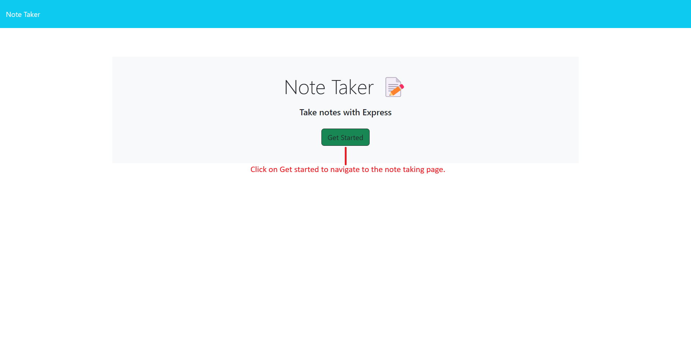
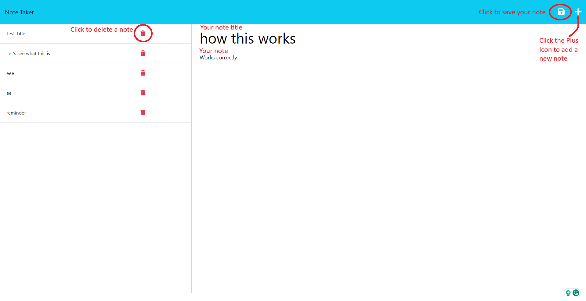
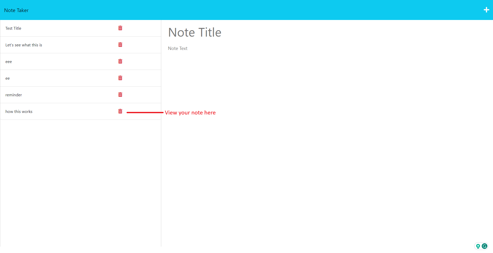

# Express.js - Note-Taking Application

## Description

This web-based note-taking application allows users to add, save, and delete their personal notes that they longer need. It can be used for noting down reminders, ideas, or just their thoughts.

## Table of Contents

- [Installation](#installation)
- [Usage](#usage)
- [Walkthrough](#walkthrough)
- [Features](#features)
- [Credits](#credits)
- [License](#license)

## Installation

### Accessing the Deployed Application

Open your favorite web browser (e.g., Chrome, Firefox, Safari), and navigate to the Application URL below:

[Click here to use the application](https://damp-reef-00063-48318da241c2.herokuapp.com/)

[View GitHub Repo](https://github.com/hafsah1976/Express.js-Challenge-Note-Taker)

## Usage

[1]. The Homepage

[2]. Save a note

[3]. View saved notes

## Walkthrough

[Walkthrough in VSCODE](https://watch.screencastify.com/v/R7MzltklYRBTehOunnOB)

## Features

- **Create a Note & Save it**: Users can create new notes by providing a title and text then click on the save icon on the top right.
- **View a Note**: Users can view their existing notes in the right column, displaying the note titles. Clicking on the note title will let the users see the title and details in the left column.
- **Delete a Note**: Users can delete notes they no longer need in the right column.
- **Responsive Design**: The application is designed to be responsive, adapting to different screen sizes on various devices.

## Credits

[Class Activities - Louis Delia & Marcos Mujica](https://git.bootcampcontent.com/George-Washington-University/GWU-VIRT-FSF-PT-05-2023-U-LOLC/-/tree/main/11-Express)

[Node JS](https://nodejs.org/docs/latest-v16.x/api/fs.html#synchronous-example)

[Server-side Express_NodeJS Routes](https://developer.mozilla.org/en-US/docs/Learn/Server-side/Express_Nodejs/routes)

[Express JS Routes](https://www.youtube.com/watch?v=0Hu27PoloYw)

## License

### Badge

Permission is hereby granted, free of charge, to any person obtaining a copy of this software and associated documentation files (the “Software”), to deal in the Software without restriction, including without limitation the rights to use, copy, modify, merge, publish, distribute, sublicense, and/or sell copies of the Software, and to permit persons to whom the Software is furnished to do so, subject to the following conditions:

The above copyright notice and this permission notice shall be included in all copies or substantial portions of the Software.

THE SOFTWARE IS PROVIDED “AS IS”, WITHOUT WARRANTY OF ANY KIND, EXPRESS OR IMPLIED, INCLUDING BUT NOT LIMITED TO THE WARRANTIES OF MERCHANTABILITY, FITNESS FOR A PARTICULAR PURPOSE AND NONINFRINGEMENT. IN NO EVENT SHALL THE AUTHORS OR COPYRIGHT HOLDERS BE LIABLE FOR ANY CLAIM, DAMAGES OR OTHER LIABILITY, WHETHER IN AN ACTION OF CONTRACT, TORT OR OTHERWISE, ARISING FROM, OUT OF OR IN CONNECTION WITH THE SOFTWARE OR THE USE OR OTHER DEALINGS IN THE SOFTWARE.
